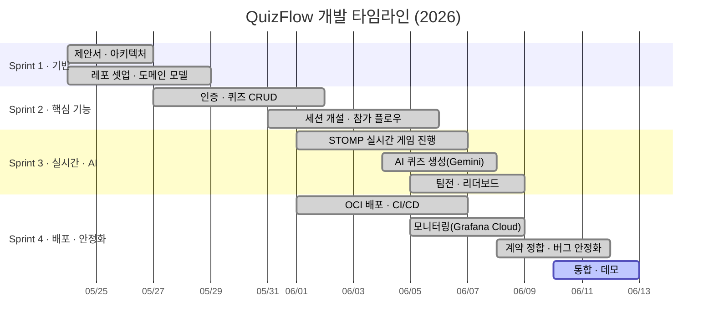

# 🗺️ 로드맵 (Roadmap)

크누피(QuizFlow)의 개발 단계와 향후 계획입니다. 마일스톤은 각 레포의 **Milestones** 탭,
세부 항목은 **Issues** 로 추적합니다.

## 📅 타임라인

## 🏁 마일스톤

| 스프린트 | 기간 | 목표 | 상태 |
|---|---|---|---|
| **Sprint 1 — 기반 구축** | 05/24 – 05/29 | 레포·아키텍처·도메인 모델 확정 | ✅ 완료 |
| **Sprint 2 — 핵심 기능** | 05/27 – 06/02 | 인증, 퀴즈 CRUD, 세션/참가 플로우 | ✅ 완료 |
| **Sprint 3 — 실시간 & AI** | 06/01 – 06/08 | STOMP 게임 진행, AI 생성, 팀전·리더보드 | ✅ 완료 |
| **Sprint 4 — 배포 & 안정화** | 06/01 – 06/12 | OCI 배포·CI/CD, 모니터링, 계약 정합·QA | 🚧 진행 중 |

## ✅ 완료 (Done)

- [x] 무로그인 PIN 참가 + 호스트 세션 운영
- [x] STOMP over WebSocket 실시간 진행(SockJS fallback)
- [x] AI 퀴즈 생성(텍스트/PDF) + 해설 (Google Gemini)
- [x] 개인전/팀전, 응답속도 가중 리더보드
- [x] OCI Always Free VM 2대 · Docker Compose · nginx · HTTPS
- [x] GitHub Actions 자동 배포(ghcr → SSH compose up)
- [x] Grafana Cloud + Alloy 관측성, 백엔드 종합 대시보드
- [x] 유령 세션 자동 종료, 단건/일괄/전체 강퇴

## 🔭 백로그 (향후 계획)

> 상세 항목은 각 레포 Issues에서 추적합니다. ([ARCHITECTURE §11 제약](ARCHITECTURE.md) 기반)

### 안정성 · 보안
- [ ] **HttpSession 영속화** — Redis 세션 스토어로 재배포 시 로그인 유지
- [ ] **WebSocket 인증 토큰** — 참가자 입장 시 발급한 토큰으로 채널 보호
- [ ] **third-party 쿠키 대응** — 동일 도메인 서브패스 또는 토큰 기반 인증 전환

### 기능
- [ ] 호스트 문제 건너뛰기 / 일시정지
- [ ] 퀴즈 결과 CSV/PDF 내보내기
- [ ] 문제 은행(재사용) · 퀴즈 복제
- [ ] 이미지 첨부 문제 유형

### 인프라 · 운영
- [ ] managed DB 또는 백업 자동화
- [ ] 무중단 배포(blue-green) 검토
- [ ] e2e 스모크 테스트를 CI에 추가
- [ ] Alloy 알림 룰 확장(5xx·힙·p95)

---
업데이트 기준일: 2026-06-12 · 변경은 PR로 제안해 주세요.
