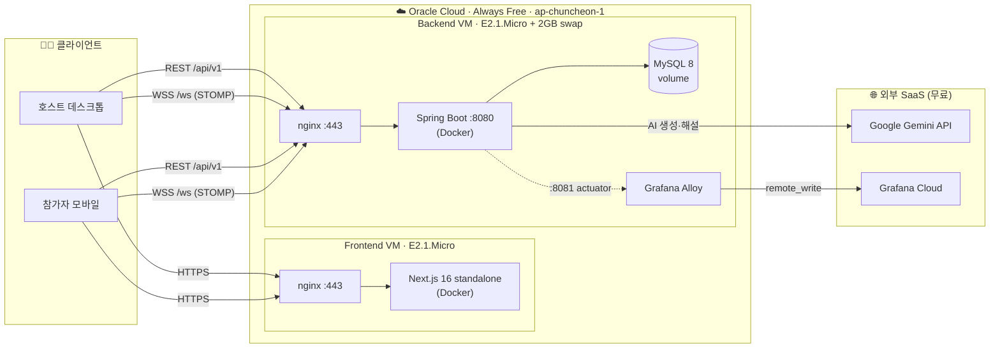
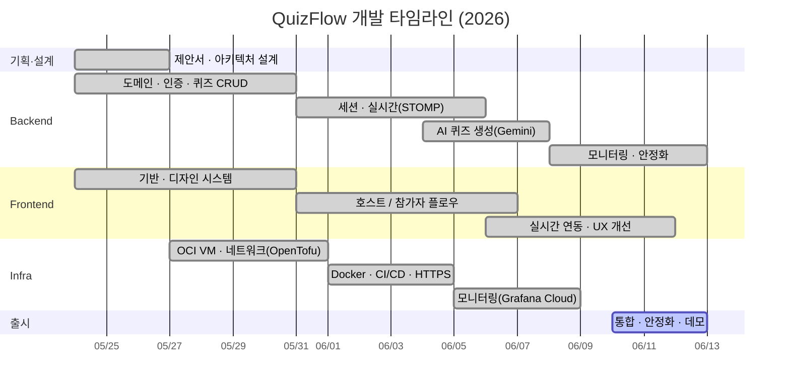

# 🎯 크누피 · QuizFlow (KNU-P)

### 경북대학교 실시간 퀴즈 플랫폼

호스트가 퀴즈를 만들면, 참가자는 **PIN 하나로 로그인 없이 입장**해 
실시간으로 함께 풉니다. AI가 자료를 퀴즈로 바꿔주고, 끝나면 골드 시상까지.

 

 

---

## 📚 한눈에 보기

> **크누피**는 경북대학교(KNU) 강의실을 위한 Kahoot 스타일의 실시간 퀴즈 서비스입니다.
> 교수·강사(**호스트**)는 로그인 후 퀴즈를 만들고 세션을 열며, 학생(**참가자**)은 화면에 뜬
> **6자리 PIN**으로 로그인 없이 입장해 모바일에서 실시간으로 참여합니다.

| | 호스트 (교수·강사) | 참가자 (학생) |
|---|---|---|
| **로그인** | 필요 (세션 쿠키) | **불필요** (PIN 입장) |
| **플로우** | 퀴즈 생성 → 세션 개설 → 진행 → 결과 | PIN 입력 → 닉네임 → 실시간 참여 → 순위 |
| **화면** | PD 조종석(정답률·실시간 TOP5) | 타이머 링·4색 도형·셀러브레이션 |

---

## 🧩 레포지토리

조직은 **3개의 레포**로 구성된 마이크로 구조입니다. 각 레포는 독립 배포됩니다.

| 레포 | 설명 | 스택 | 상태 |
|---|---|---|---|
| **[frontend](https://github.com/knup-project/frontend)** | 호스트 대시보드 + 참가자 라이브 화면 (FSD 구조) | Next.js 16 · React 19 · TS · Tailwind v4 · Zustand · TanStack Query · STOMP |   |
| **[backend](https://github.com/knup-project/backend)** | REST + WebSocket API, AI 퀴즈 생성, 게임 진행 엔진 | Spring Boot 3.5 · Java 21 · JPA · WebSocket · Gemini · Actuator |   |
| **[infra](https://github.com/knup-project/infra)** | IaC, VM 부트스트랩, CI/CD, 모니터링 | OpenTofu · OCI · Docker Compose · nginx · GitHub Actions · Grafana |   |

---

## 🏗️ 시스템 아키텍처

> 자세한 구현 아키텍처(엔드포인트 전수·데이터 모델·보안 제약·CI/CD)는
> **[📐 docs/ARCHITECTURE.md](https://github.com/knup-project/.github/blob/main/docs/ARCHITECTURE.md)** 참고.

---

## ✨ 핵심 기능

- 🎮 **실시간 게임 진행** — STOMP over WebSocket(SockJS fallback)로 문제·결과·리더보드 브로드캐스트
- 🔑 **무로그인 참가** — 6자리 PIN + 닉네임만으로 입장, 참가자 부담 0
- 🤖 **AI 퀴즈 생성** — 텍스트/PDF를 Google Gemini가 객관식·O/X·단답으로 자동 변환 + 해설
- 👥 **개인전 / 팀전** — 자동 팀 배정, 팀 리더보드
- 🏆 **라이브 리더보드** — 응답 속도 가중 점수, 골드 1등 시상·셀러브레이션 모션
- 🛡️ **호스트 운영** — 실시간 인원·강퇴(단건/일괄/전체)·유령 세션 자동 종료
- 📊 **관측성** — Actuator + Micrometer → Alloy → Grafana Cloud 대시보드/알림

---

## 🗓️ 개발 로드맵 (Gantt)

전체 마일스톤·백로그는 **[📋 docs/ROADMAP.md](https://github.com/knup-project/.github/blob/main/docs/ROADMAP.md)** 에 정리되어 있습니다.

---

## 👥 팀 — knup-project

> 경북대학교 오픈소스 SW 팀 프로젝트 팀입니다.

| 역할 | 멤버 | 담당 |
|---|---|---|
| 🎨 **Frontend Lead** | [@eunwoo-levi](https://github.com/eunwoo-levi) | Next.js 앱, 디자인 시스템, 실시간 UX |
| ⚙️ **Backend Lead** | [@hanseung-yeon](https://github.com/hanseung-yeon) | API·게임 엔진, 인증, AI 연동 |
| ☁️ **Infra Lead** | [@JinVibe](https://github.com/JinVibe) | OCI/OpenTofu, CI/CD, 모니터링 |
| 🛠️ **Infra · DevOps · QA** | [@lsmin3388](https://github.com/lsmin3388) | 배포 자동화, 크로스레포 계약 정합, 품질 보증 |

---

## 🛠️ 기술 스택

**Frontend** 
     

**Backend** 
     

**Infra & Ops** 
     

---

## 🤝 기여하기

오픈소스 팀 프로젝트입니다. 컨벤션과 PR 흐름은 조직 공통 문서를 따릅니다.

- 📜 [기여 가이드 (CONTRIBUTING)](https://github.com/knup-project/.github/blob/main/CONTRIBUTING.md)
- 🤲 [행동 강령 (Code of Conduct)](https://github.com/knup-project/.github/blob/main/CODE_OF_CONDUCT.md)
- 🔐 [보안 정책 (Security)](https://github.com/knup-project/.github/blob/main/SECURITY.md)

> 커밋은 [Conventional Commits](https://www.conventionalcommits.org/), 브랜치는 `feat/*` · `fix/*` · `chore/*` · `refactor/*` · `docs/*`, 머지는 PR 기반.

 

**Made with ❤️ & ☕ by the knup-project team · 경북대학교 2026**

